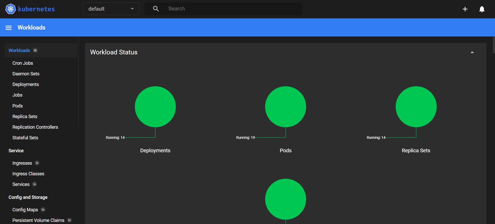
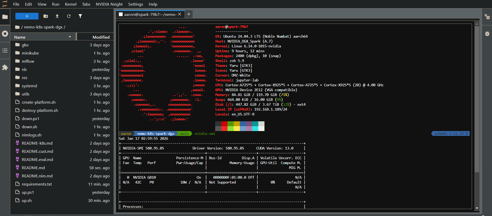
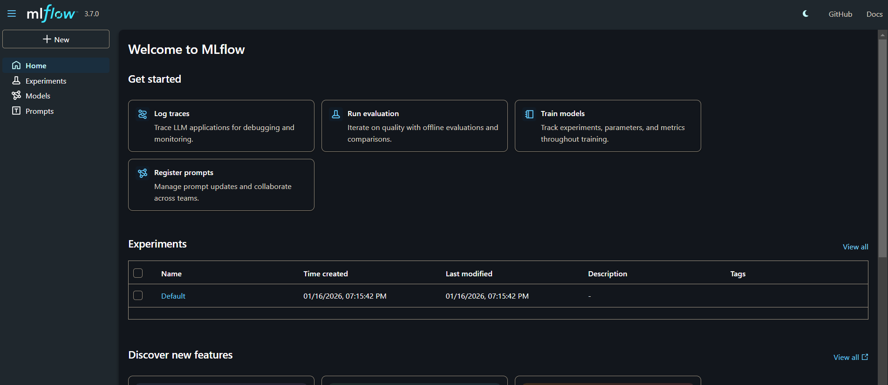

# NVidia NeMo Microservices Cluster on minikube/Spark DGX

## Issues (1/13/2026)

- The current minikube `nvidia-device-plugin` addon ships with an issue that prevents the spark-dgx GPU from advertising itself as being available. I patched the nemo creation script to install a newer version of this addon that contained the fix. 
- I also use a values.yaml file to disable `guardrails` for now as it hasn't been ported to ARM/SparkDGX arch yet.
- In addition, the current NIM's ship with a TensorRT issue that prevents them from coming up, so I use patched versions of those for now.
- The create script warned that the GB10 GPU was not on the 'approved' list .. but it is clearly capable of running these models, so I patched that warning.
- The script also requires that 2 GPUs (on their list of supported GPUs) are available. But I don't have the money for another Spark DGX, so I patched that to 1 and will have to devise a way to share the GPU between inference and customization/eval workflows... likely scaling down inference pods to do cust/eval and vice versa... fingers crossed this works !

[NeMo Framework](https://docs.nvidia.com/nemo-framework/user-guide/latest/overview.html)

[NeMo Microservices](https://docs.nvidia.com/nemo/microservices/latest/get-started/index.html)

## Installing NeMo on minikube

Create a pyenv virtual environment and activate it

    pyenv install 3.11.14
    pyenv virtualenv 3.11.14 pyNeMo 
    cd nemo-k8s-spark-dgx
    pyenv local pyNeMo
    pip install -r requirements.txt

To install the NeMo platform (with MLflow):

    cd nemo-k8s-spark-dgx
    
    chmod +x *.sh 

    ./create-platform.sh

and to clean up:

    ./destroy-platform.sh

If all goes well, after about 30m you will see:

    NAME                                                              READY   STATUS    RESTARTS      AGE
    modeldeployment-meta-llama-3-1-8b-instruct-dgx-spark-56b767rsjw   1/1     Running   0             62m
    nemo-core-api-54674f5989-khqrf                                    1/1     Running   0             73m
    nemo-core-controller-9d9b6b99c-gmrk6                              1/1     Running   1 (66m ago)   73m
    nemo-core-jobs-logcollector-7787759b6c-ml2ts                      1/1     Running   0             73m
    nemo-customizer-5949755697-ncdgt                                  1/1     Running   2 (66m ago)   73m
    nemo-customizerdb-0                                               1/1     Running   0             73m
    nemo-data-designer-6c6df98589-kkxbf                               1/1     Running   0             73m
    nemo-data-store-556cb7ff85-fc6b4                                  1/1     Running   0             73m
    nemo-deployment-management-f489c5d5-725kf                         1/1     Running   0             73m
    nemo-entity-store-77bb854685-fw9kz                                1/1     Running   0             73m
    nemo-entity-storedb-0                                             1/1     Running   0             73m
    nemo-evaluator-7d4d8d6b7-mx9bw                                    2/2     Running   0             73m
    nemo-evaluatordb-0                                                1/1     Running   0             73m
    nemo-jobsdb-0                                                     1/1     Running   0             73m
    nemo-nemo-operator-controller-manager-7bd775c8-fxglj              2/2     Running   0             73m
    nemo-nim-operator-bbdfdb6cb-4fd6h                                 1/1     Running   0             73m
    nemo-nim-proxy-b5f6b5765-pnhl8                                    1/1     Running   0             73m
    nemo-opentelemetry-collector-8f484bdff-7v5bz                      1/1     Running   0             73m
    nemo-postgresql-0                                                 1/1     Running   0             73m

━━━━━━━━━━━━━━━━━━━━━━━━━━━━━━━━━━━━━━━━━━━━━━━━━
[INFO] 🎉 Setup Complete! NeMo Microservices Platform is ready!
━━━━━━━━━━━━━━━━━━━━━━━━━━━━━━━━━━━━━━━━━━━━━━━━━

[INFO] 📍 Your endpoints:

  • NIM Gateway:   http://nim.test

  • Data Store:    http://data-store.test

  • Platform APIs: http://nemo.test (all /v1/* endpoints)

[INFO] 📚 Quick tests:

  • List models:        curl http://nim.test/v1/models

  • Data Store health:  curl http://data-store.test/v1/health

  • List namespaces:    curl http://nemo.test/v1/namespaces

  • Customization API:  curl http://nemo.test/v1/customization/jobs

[INFO] 💡 Useful commands:

  • View all pods:        kubectl get pods -n default

  • Check service status: kubectl get svc -n default

  • View logs:            kubectl logs <pod-name> -n default

  • Clean up:             ./destroy-nmp-deployment.sh

[INFO] 📖 Documentation: https://docs.nvidia.com/nemo/microservices/

Now you can expose UI over in your Windows laptop:

powershell:

    ./up.ps1

## UI endpoints (from Windows browser):

### Minikube dashboard

windows browser (after `up.ps1`):

    http://127.0.0.1:8001/api/v1/namespaces/kubernetes-dashboard/services/http:kubernetes-dashboard:/proxy/#/workloads?namespace=default

### JupyterLAB 

windows browser (after `up.ps1`):

    http://127.0.0.1:8888/lab

### MLflow

windows browser (after `up.ps1`):

    http://127.0.0.1:5000/

## up/down scripts (graceful start/stop when putting spark/laptop to sleep)

### resuming session:

spark (after reboot):

    ./up.sh

powershell (after spark reboot):

    ./up.ps1

### pausing session:

powershell:

    ./down.ps1

spark:

    ./down.sh

